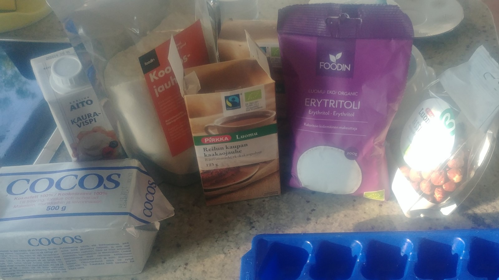
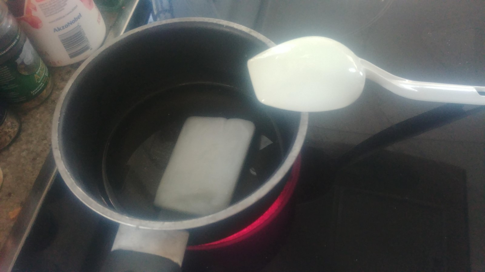
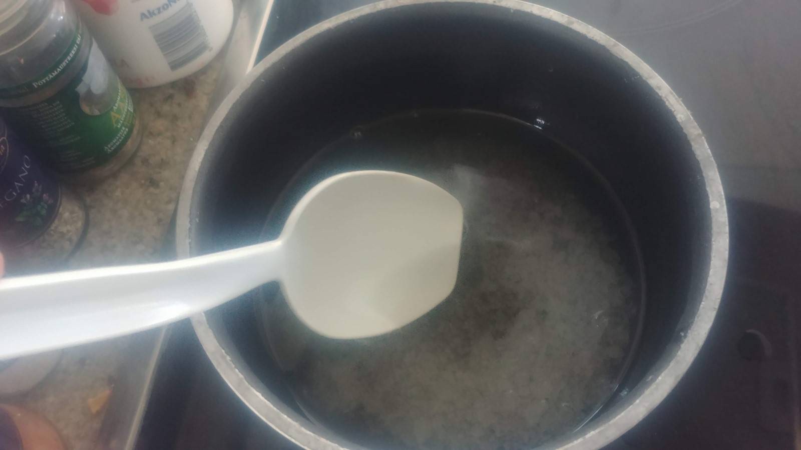
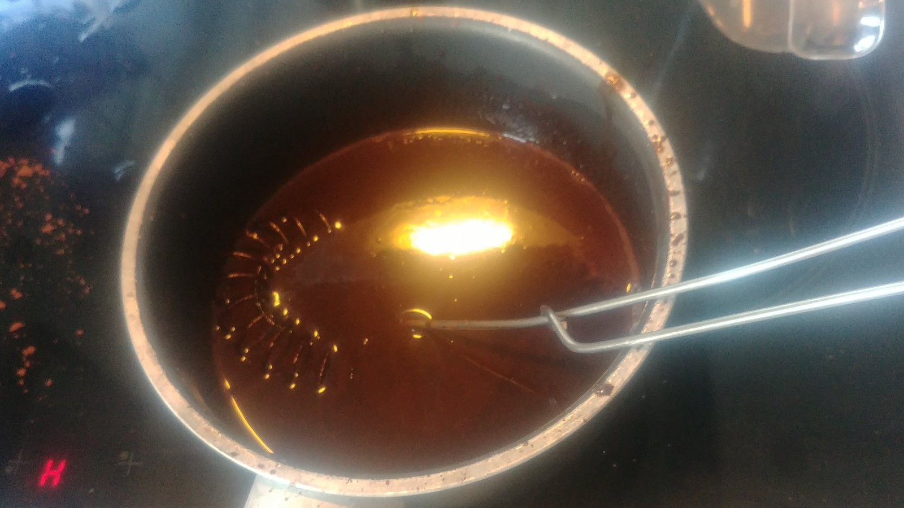
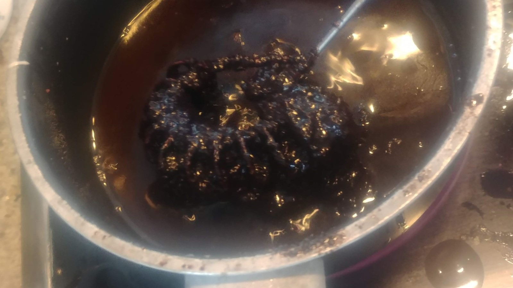
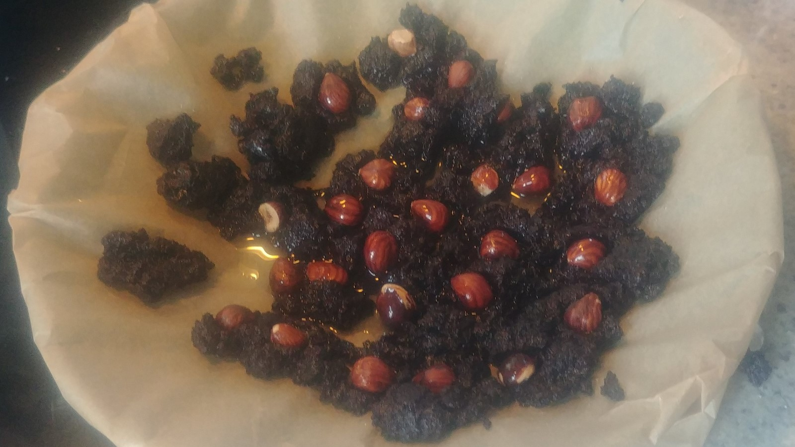
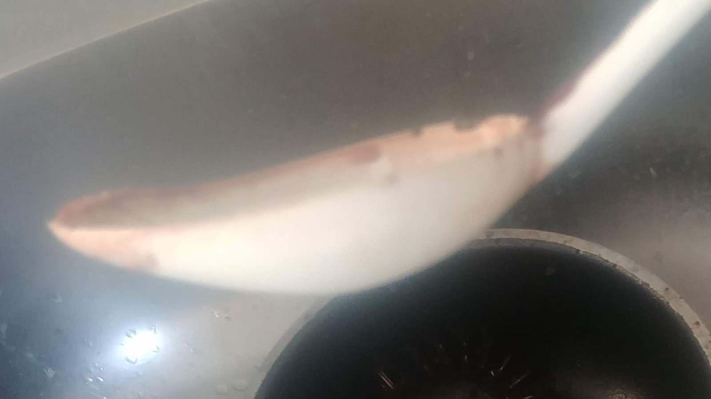

# 2019-06-02 Burn my ladle

On the first leg of my journey in search of a healthy chocolate,
I set out with

 * 100 g coconut butter (best before 2 years ago)
 * 1 dl erytritol
 * 1 dl cocoa powder
 * 1 spoon of coconut flour
 * 5 cl oat whip cream

## Melt coconut butter in pot

It took a while because it was so hard.

## Melt erytritol and ladle

Once all of the coconut butter had melted, I dropped erytritol into it and continued cooking. Now I immediatelly smelled a weird smell that I associated with something inedible but failed to identify what it was.

Erytritol crystallized for a good while before actually melting. I was worried for a while there.

## Mix cocoa in

I first tried to mix cocoa in through a sieve, but it stuck in. Instead I noticed my ladle becoming soft and losing shape, so I switched it for a whisk. With that, coca mixed in nicely.

## Add flour and cream

I dropped a spoonful of coconut flour into the mix to ensure it would become solid. It immediately formed clumps. I tried to save the situation with half a desiliter of oat cream (for whipping, because I didn't have any other kind). It didn't help.

## Clump and burn

While I was trying to whisk the stuff evenly, seeking help from reheating it, it just stayed clumped, smelled burnt, and separated from a transparent fluid that I took to be the coconut butter.

I poured some of the fluid off and dropped the clumpy mass onto a plate that I suddenly had covered with baking paper.

## Finishing touch

I added some hazelnuts because that was my original plan, although I was a bit torn with the thought that it'd all probably end up as just more waste.

I cut the clumpy mass to pieces the best I could with a spoon.

The end result seems something far, far away from [Strömsö](https://yle.fi/aihe/stromso).

After it had cooled some time in the fridge, we checked the taste. It was suspicious indeed: more plastic than burnt. It's going to be easy to do better next time.

## Lessons learned

1. Avoid cooking the ingredients for too long.
2. Do not use plastic kitchen utensils as they may not withstand the heat or extreme chemistry involved.
3. Do not underestimate the clumping power of coconut flour. 5 cl of oat cream does not protect against it.
4. Erytritol provides nice and accurate sweetness, so keep trying.
